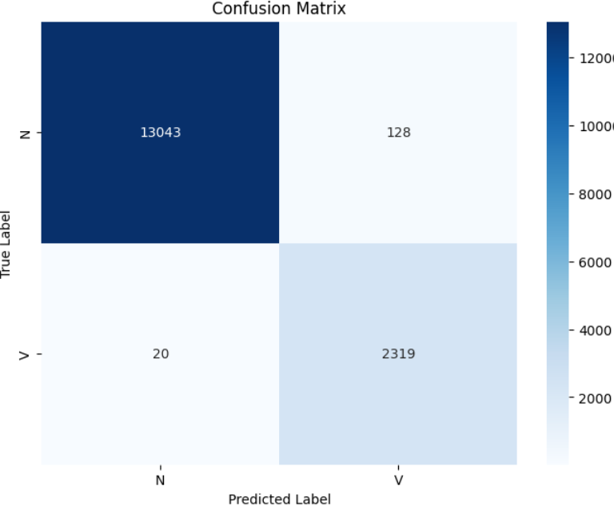
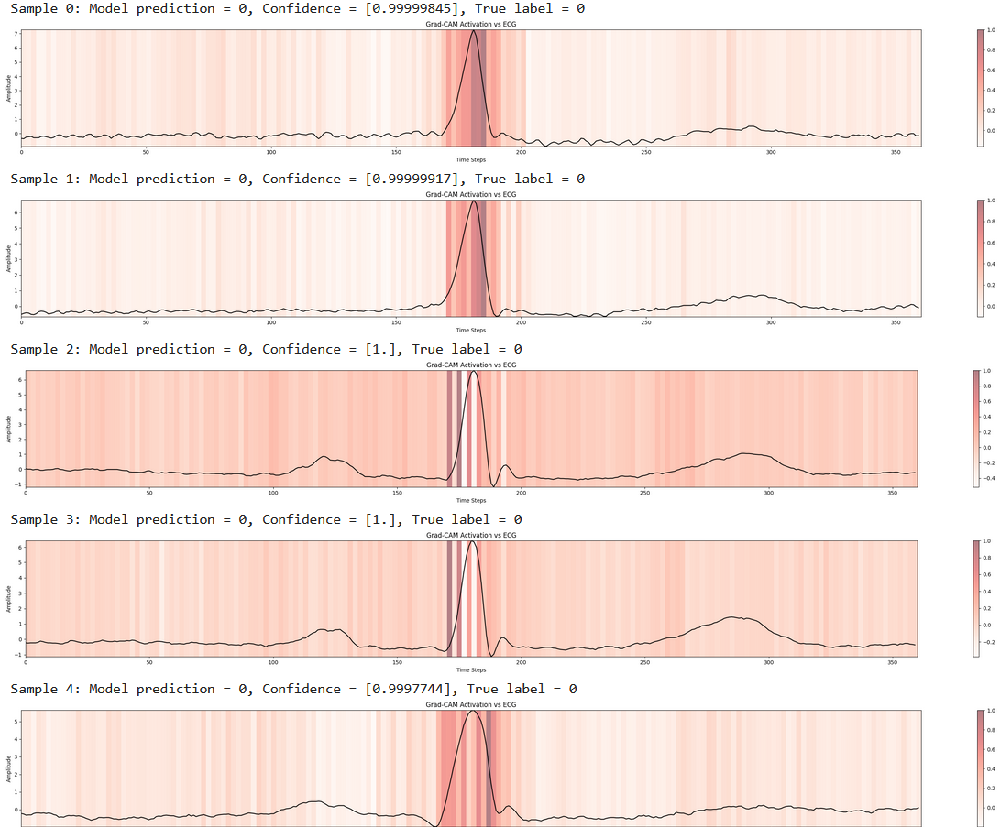
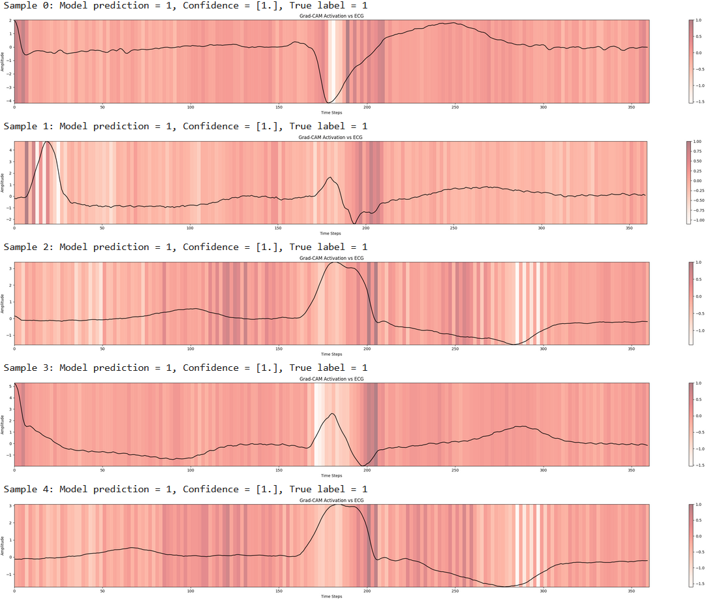

# ECG Arrhythmia Classification Project

*Detecting Premature Ventricular Contractions (PVCs) Using 1D CNNs*

## 1. Data Acquisition & Preparation

**Source:** MIT-BIH Arrhythmia Database (PhysioNet)

- Downloaded 44 patient records (excluded paced rhythms) via WFDB Python package

- Patient-wise split (70% train / 10% validation / 20% test) to prevent data leakage

- Records included: ['100', '101', ..., '234'] (Full list in code)

**Ethical Considerations:**

- PhysioNet credentialed access

- HIPAA-compliant de-identified data

## 2. Preprocessing Pipeline

**Key Steps:**

1. **R-Peak Centering:** Extracted 1-second segments (360 samples) around annotated beats
2. **Class Filtering:** Kept only Normal (N) and PVC (V) beats per AAMI standards
3. **Z-Score Normalization:** (x - μ)/σ per segment to handle amplitude variation
4. **Padding:** Zero-padded edge segments to maintain 360-sample length

**Class Distribution:**
| Class | Train	| Validation | Test |
| --- | --- | --- | --- |
| N	| 55,635 | 5,740 | 13,171 |
| V	| 4,094	| 470 | 2,339 |

## 3. Model Architecture

**1D CNN for Temporal Pattern Recognition**

|  Layer (type) | Output Shape | Param #  |
|---|---|---|
| conv1d (Conv1D)  | (None, 360, 32)  | 192  |                                                           
| batch_normalization (BatchNormalization) | (None, 360, 32) | 128 |
| max_pooling1d (MaxPooling1D) | (None, 180, 32) |  0  |
| dropout (Dropout)    |       (None, 180, 32)     |      0         |                                               
| conv1d_1 (Conv1D)    |       (None, 180, 64)       |    6208      |                                                            
| batch_normalization_1 (BatchNormalization) | (None, 180, 64)     |     256      | 
| max_pooling1d_1 (MaxPooling 1D) | (None, 90, 64)     |      0     |    
| dropout (Dropout)    |       (None, 90, 64)     |      0         | 
| flatten (Flatten)     |      (None, 5760)      |        0         |
| dense (Dense)       |        (None, 64)        |        368,704 |
| dropout_1 (Dropout)    |     (None, 64)       |         0    |
| dense_1 (Dense)        |     (None, 2)     |            130 |

**Design Rationale:**
- Small kernel sizes (5-3) to capture local ECG morphologies
- Progressive downsampling preserves temporal relationships
- Dropout layers (20-40%) prevent overfitting on imbalanced data

## 4. Data Augmentation Strategy

Use Generator class to apply random transformations of training data to simulate noise and prevent overfitting.

**ECGDataGenerator Class Features:**

- Time Warping: ±20% stretch/compression using linear interpolation
- Additive Noise: Gaussian (μ=0, σ=0.01×segment σ)
- Amplitude Scaling: 0.8×-1.2× random gain

## 5. Training Protocol

**Imbalanced Learning Approach:**
- Class Weights: Inversely proportional to class frequency
- Early Stopping: Patience=10 epochs (val_loss)

## 6. Results & Clinical Relevance

**Test Performance:**

| Metric | Normal (N) | PVC (V) |
| --- | --- | --- |
| Precision | 1.00	| 0.95 |
| Recall	| 0.99	| 0.99 |
| F1-Score	| 0.99	| 0.97 |

**Confusion Matrix:**

| Actual\Predicted | N | V |
| --- | --- | --- |
| N	| 13043	| 128 |
| V	| 20	| 2319 |

**Impact:**
- 99% recall on PVCs minimizes missed critical events
- Deployable as preliminary screening tool for Holter monitoring

[]

## 7. Model Interpretation

**Grad-CAM Visualization:**

Normal (N) QRS Samples:
[]

Premature Ventricular Contraction (V) Samples:
[]

**Key Insights:**
- Model focuses on QRS complex widening (hallmark of PVCs)
- Minimal attention to P-waves/T-waves in PVC classification
- Aligns with clinical PVC characteristics

## 8. Conclusion & Future Work

**Achievements:**
- Developed end-to-end ECG analysis pipeline
- Demonstrated effective class imbalance handling
- Achieved clinically-aligned interpretability

**Technologies Used:**
Python > TensorFlow > WFDB > NumPy > Matplotlib > Scikit-learn

**Next Steps:**
- Real-time inference implementation
- Integration with wearable device data streams
- Multiclass extension for full arrhythmia suite